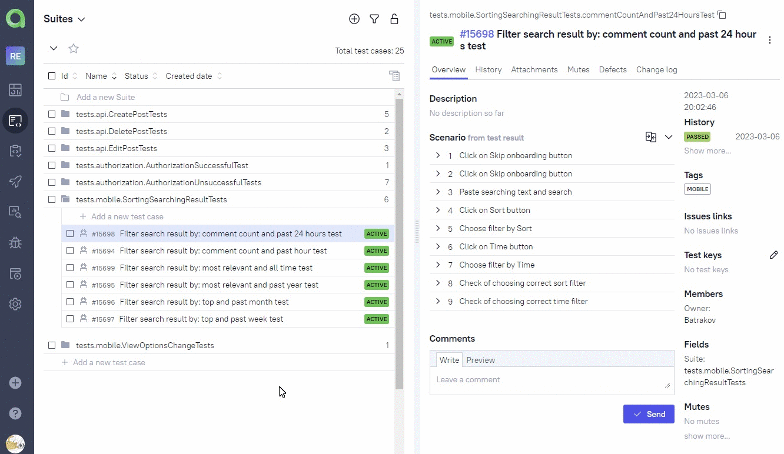
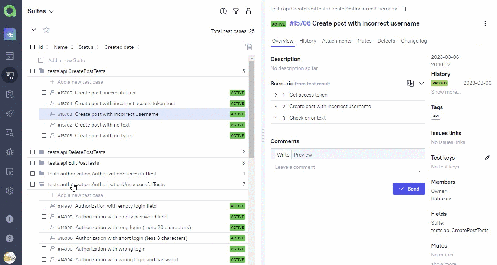
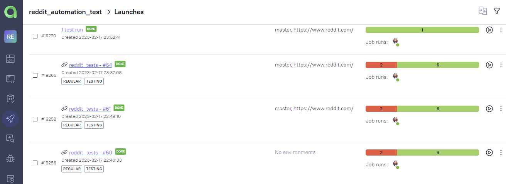
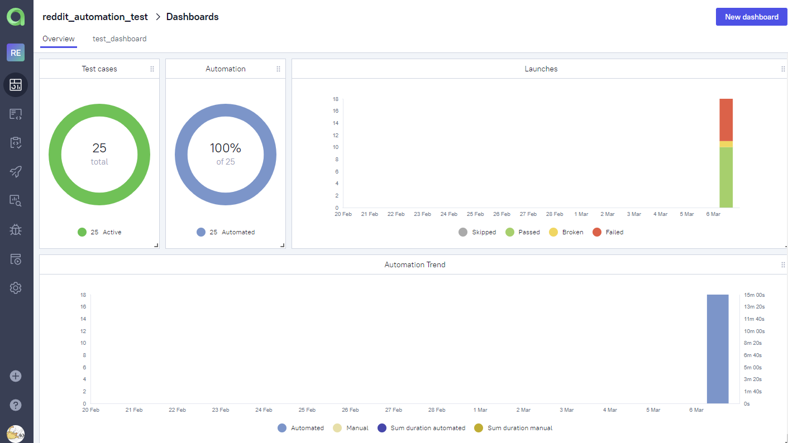

# Test automation project for [Reddit](https://reddit.com/)


> Reddit is an American social news aggregation, content rating, and discussion website. Registered users submit content
> to the site such as links, text posts, images, and videos, which are then voted up or down by other members. Consists of
> website and mobile applications for Android and iOS.

# <a name="TableOfContents">Table of contents</a>

+ [Description](#Description)
+ [Tools and technologies](#Technology)
+ [Coverage of tests](#)
    + [UI tests](#)
    + [Mobile tests](#)
    + [API test](#)
+ [How to run](#Jenkins)
    + [Gradle command](#GradleCommand)
    + [Local run](#GradleCommand)
    + [Run in Jenkins](#RunInJenkins)
+ [Telegram Notifications](#TelegramNotifications)
+ [Test results report in Allure Report](#AllureReport)
+ [Allure TestOps integration](#AllureTestOps)
    + [Project in Allure TestOps](#AllureTestOpsProject)
    + [Start a run of custom set of tests](#AllureTestOpsStartTests)
    + [Dashboards](#Dashboards)

# <a name="Description">Description</a>

The test project consists of Web, mobile and API tests.\
A brief list of interesting facts about the project:

- [x] `Page Object` with steps using `Chain of Invocations`
- [x] Fake data generating with `Faker` library
- [x] Parametrized tests
- [x] Parametrized build
- [x] Different configuration files for test running depending on build parameters
- [x] Config with `Owner` library
- [x] Using `Lombok` for models for API tests
- [x] Objects serialization/deserialization for API requests/responses using `Jackson`
- [x] Using request/response specifications for API tests
- [x] Custom Allure listener for beautiful API requests/responses logging
- [x] `Allure TestOps` integration
- [x] Autotests as test documentation

# <a name="Technology">Tools and a technologies</a>

<p  align="center">
  <code></code>
  <code></code>
  <code></code>
  <code></code>
  <code></code>
  <code></code>
  <code></code>
  <code></code>
  <code></code>
  <code></code>
  <code></code>
  <code></code>
  <code></code>
  <code></code>
  <code></code>
  <code></code>
</p>

The autotests in this project are written in `Java` using `Selenide` framework.\
`Gradle` - is used as a build automation tool.  \
`JUnit5` - to execute tests.\
`REST Assured` - for easy API testing of REST services.\
`Jenkins` - CI/CD for running tests remotely.\
`Selenoid` - to remote launching browsers in `Docker` containers.\
`Browserstack` - to run mobile tests.\
`Android Studio tools`, `Appium` - to tun mobile tests locally in a mobile device emulator.\
`Allure Report` - for test results visualisation.\
`Telegram Bot` - for test results notifications.\
`Allure TestOps` - as Test Management System.

# <a name="Coverage">Coverage of tests</a>

### <a name="UI tests">UI tests</a>

+ successful authorization
+ authorization with wrong login
+ authorization with wrong password
+ authorization with wrong login and password
+ authorization with short login (less 3 characters)
+ authorization with long login (more 20 characters)
+ authorization with empty login field
+ authorization with empty password field

### <a name="Mobile tests">Mobile tests</a>
+ filter search result by: most relevant and all time test
+ filter search result by: most relevant and past year test
+ filter search result by: top and past month test
+ filter search result by: top and past week test
+ filter search result by: comment count and past 24 hours test
+ filter search result by: comment count and past hour test
+ change default view setting test
+ change autoplay setting test
+ change thumbnails setting test

### <a name="API tests">API tests</a>
+ create post successful test
+ create post with incorrect access token test
+ create post with incorrect username
+ create post with no text test
+ create post with no type test
+ edit post successful test
+ edit post with incorrect access token test
+ edit post with no title test
+ delete post successful test
+ delete post with incorrect access token test

# <a name="HowToRun">How to run</a>

## <a name="GradleCommand">Gradle command</a>

To run locally use command:

```bash
gradle clean {tag} -Denv={env}
```
`tag` - tests with this tag will be executed:
>- *API*
>- *Web*
>- *Mobile*

`env` - defines an environment for running these tests:
>- *\<not defined\>(for API tests)*
>- *web_local*
>- *web_remote*
>- *android_local*
>- *android_emulator*
>- *android_browserstack*


## <a name="Localrun">Local run</a>

Credentials (login/password from Reddit, login/password from Browserstack) from Reddit account haven't upload at GitHub to save sensitive data. You need to create
property file manually and put file to `src/test/resources` with name `credentials.properties`.
Example of credentials.properties file:

```properties
login=some_login
password=somePassword
clientId=someClientId (need for oauth2 authentication)
clientSecret=someclienId (need for oauth2 authentication)
BSlogin=some_login
BSpassword=somePassword
```

## <a name="PropertyFiles">Property files</a>

Possible properties in a `${env}.properties` file:
#### <a name="UI property">UI property</a>
```properties
remoteUrl=
browserSize=
browser=
browserVersion=
baseUrl=
isRemote=
```

> - *remoteUrl* - URL for remote WebDriver
>- *browserSize* - size of browser for Web tests
>- *browser* - browser for Web tests
>- *browserVersion* - version of browser
>- *baseUrl* - base URL for Web tests
>- *isRemote* - flag for local/remote running

#### <a name="Mobile property">Mobile property</a>
```properties
remoteBSUrl= 
appUrl=
deviceName=
osVersion=
environment=
```

> - *remoteBSUrl* - URL for remote BrowserStack
>- *appUrl* - URL for remote application on BrowserStack
>- *deviceName* - name of device
>- *osVersion* - version of operating system
>- *environment* - browserStack or local

## <a name="RunInJenkins">Run in [Jenkins](https://jenkins.autotests.cloud/job/reddit_tests//)</a>

Click on "Build with Parameters" button, choose parameters, after that click on "Build":
<p  align="center">

</p>

File with credentials from Reddit and BrowserStack accounts has already attached.
<p  align="center">

</p>

# <a name="TelegramNotifications">Telegram Notifications</a>

Telegram bot sends a report to a special telegram chat by results of each build. Information about bot setting you can
find by link:https://github.com/qa-guru/allure-notifications. Bot also can be use for Slack, Email notifications.
<p  align="center">

</p>

# <a name="AllureReport">Test results report in [Allure Report](https://jenkins.autotests.cloud/job/reddit_tests/allure/)</a>

## Main page

Main page of Allure report contains some general information about ran tests.

<p align="center">
  
</p>

## List of tests with steps and test artefacts

On the page the list of the tests grouped by suites with status shown for each test.

<p align="center">
  
</p>

Each test has artefacts:
> - Screenshot
>- Page Source
>- Browser console log
>- Video

## Example video of test run from Allure report
Web

<p align="center">
  
</p>
Mobile
<p align="center">
  
</p>

# <a name="AllureTestOps">[Allure TestOps](https://allure.autotests.cloud/project/1886/dashboards) integration</a>
> The link can be accessed only by authorized users.
## <a name="AllureTestOpsProject">Project in Allure TestOps</a>
Test-cases in the project are imported and constantly updated from the code,
so there is no need in complex process of synchronization manual test-cases and autotests.\
It is enough to create and update an autotest in the code and the test-case in TMS always will be in actual state.\
Manual test-cases also can be added in TMS in case of need(via web interface or via code).
<p align="center">
  
</p>

## <a name="AllureTestOpsStartTests">Ability to start a run of custom set of tests from Allure TestOps</a>

Any person not related to autotest creation can select a set of tests, environment parameter(RunIn) and start a run.\
Allure TestOps run will be created, Jenkins job triggered with correct parameters. And results of the job will be seamlessly integrated into Allure TestOps.
<p align="center">
  
</p>

As soon as the Jenkins job is done, corresponding tests get their statuses. A tester can finish manual tests(if any) and click "Close launch".

<p align="center">
  
</p>

> After that all these test-cases(names, steps, tags etc.) will be updated according to the recent code changes.


## <a name="Dashboards">Dashboards</a>
Automation trends charts, distribution tests by some different parameters etc.:
<p align="center">
  
</p>


